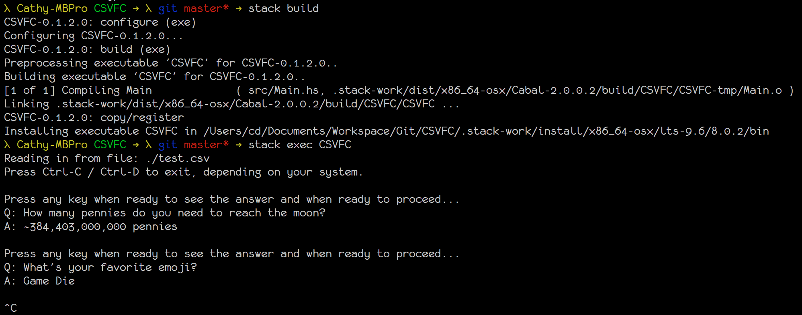

# CSVFC
Comma seperated values flash cards  


## Files
```
.
├── CSVFC.cabal -- Describes the project
├── LICENSE     -- The default licence from Stack
├── README.md   -- This file
├── Setup.hs    -- A Stack file?
├── demo.png    -- The amazing Screenie!!
├── src
│   └── main.hs -- The core logic of CSVFC
├── stack.yaml  -- Stack config
└── test.csv    -- An example csv Q&A file format

1 directory, 8 files
```

## Run
Before running you will have to manually edit the filepath varialbe in src/main.hs   

After downloading [Stack](https://docs.haskellstack.org/en/stable/README/#how-to-install), issue the following commands.  
`stack setup`  
`stack build`  
`stack exec CSVFC`   
Note: Haskell GHC will be download for you and managed for you by Stack.  

## File format
One question answer pair per line.  
Only one comma allowed in each line.  
I do very litter error handling so it might blow up :)  
For more examples see `test.csv`.  
